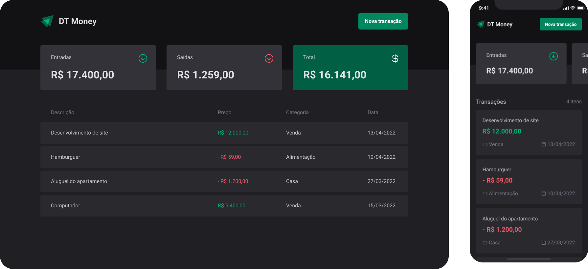

<h1 align="center">
  📖 Dt-Money
</h1>

<p align="center">
  
  
  
</p>

<div align="left">
  
</div>

## Instalação

- Clone o repositório
```bash
$ git clone https://github.com/manoguii/dt-money.git
```

- Instale as dependências
```bash
$ npm install
```

- Execute o banco de dados
```bash
$ npm run dev:server
```

- Execute a aplicação
```bash
$ npm run dev
```

## Sobre

O dt-money é um projeto para gerenciar despesas e receitas. 🚀


## Tecnologias utilizadas 👩🏻‍💻

- [ReactJS](https://reactjs.org/)
- [TypeScript](https://www.typescriptlang.org/)

---

<p align="center">Made with 💙 by Guilherme David</p>