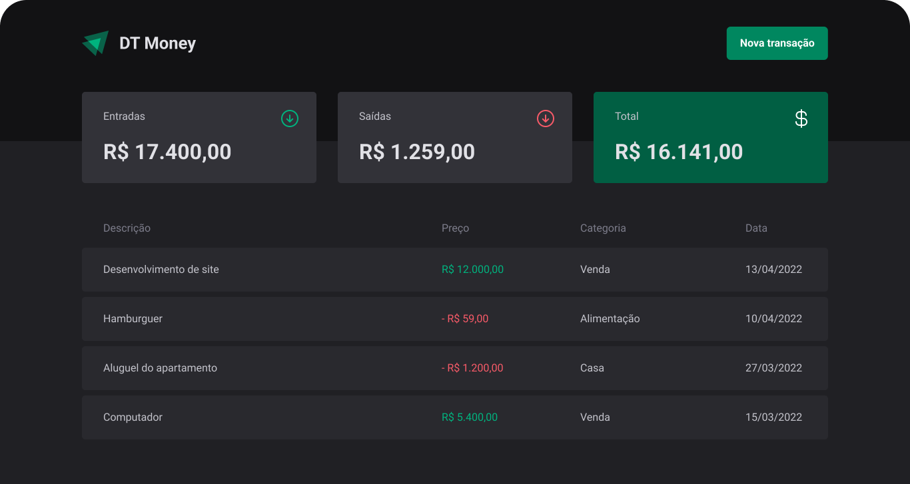

# Dt-Money



## Sobre

O dt-money é um projeto de controle financeiro para gerenciar gastos, permite criar despesas e receitas, o usuário consegue acompanhar o balanço a cada nova transação. Esse projeto usa o json server para simular um banco da dados entre outros conceitos do react.

## Instalação

```bash
git clone https://github.com/manoguii/dt-money.git
```

- Para rodar o projeto localmente
  1. Instale as dependências ```npm install```
  2. Execute o servidor com `npm run dev:server`
  3. Execute a aplicação. ```npm run dev```
  4. Acesse `http://localhost:3000`

## Tecnologias

Algumas tecnologias utilizadas para construção da aplicação.

- [ReactJS](https://reactjs.org/)
- [TypeScript](https://www.typescriptlang.org/)
- [Styled Components](https://styled-components.com/)
- [Radix UI](https://www.radix-ui.com/)
- [React Hook Form](https://www.react-hook-form.com/)
- [Zod](https://zod.dev/)
- [JSON Server](https://github.com/typicode/json-server)

---

<center>Made with 💙 by Guilherme David</center>
